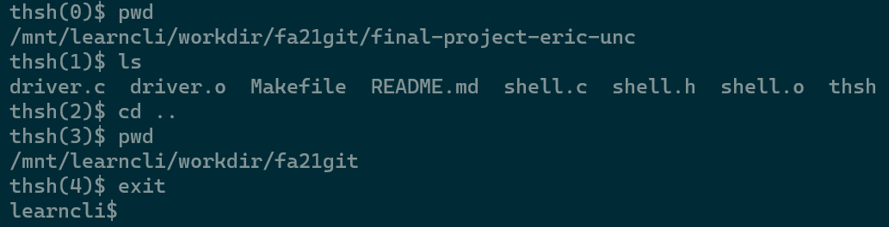

# COMP 211 Final Project: Tar Heel Shell
Now that you've familiarized yourself with the command line interface over the course of the semester, you will have the opportunity to build your own simple "Tar Heel" shell! But don't fret - when we say simple, we mean simple. The shell specified in this assignment is merely capable of changing directories and executing system programs such as `pwd` and `ls`. The goal of this assignment is to familiarize you with system-related library functions and to give you the pride of knowing that something you've been working with all semester is something that you could have built all along.

#### Background Reading
- Kris Jordan's [Learn a CLI chapter 2: Directories, Files, and Paths](https://sakai.unc.edu/access/content/group/167842e9-e6e0-4d16-81bd-842fcf59831e/Supplemental/learn-a-cli-ch2-directories-files-paths.pdf) (specifically section 2.1, 2.2)
- Arpaci-Dusseau, [Operating Systems: Three Easy Pieces](https://pages.cs.wisc.edu/~remzi/OSTEP/) course textbook, [Chapter 5](https://pages.cs.wisc.edu/~remzi/OSTEP/cpu-api.pdf)
- [Process API lecture](https://sakai.unc.edu/access/content/group/167842e9-e6e0-4d16-81bd-842fcf59831e/Lecture%20Slides/11_16_21.pdf).

## Project Structure
Four files are included in this project:
* `Makefile`- contains information used to compile your program with the `make` command. **Please do not modify.**
* `shell.h`- includes declarations and specifications for all of the functions in `shell.c`. **Please do not modify.**
* `shell.c`- contains function definitions for all functions in `shell.c`. In particular, your goal for this assignment will be to implement `find_fullpath` and `execute`.
* `driver.c`- contains the main function, which is just a loop that reads in a command and uses the functions written in `shell.c` to determine whether the command is valid and handle it appropriately. Reading this file before you begin may help you understand the usage of the functions you must implement. **Please do not modify**.

#### Honor Code Header
Please include the honor code header at the top of the `shell.c` file. Since we do grade manually for style we do not include names on code listings to avoid biasing the grading.
```c
// PID: 9DigitPidNoSpacesOrDashes
// I pledge the COMP 211 honor code.
```

### Shell Fundamentals
A shell command takes the form `<command_name> <arg_1> <arg_2> ...` with an arbitrary number of arguments and an arbitrary amount of space in between each term. `<command_name>` is the name of an executable file, the rest of the arguments are parameters passed to the executable. When a command is entered, a shell will find the absolute path to `<command_name>` and spawn a new process with the path to the executable and supply its parameters. 

How does the shell locate the exact location of this command?

This is where the concept of the `PATH` environment variable comes in. Environment variables basically amount to variables that are globally available to your system. The purpose of the PATH variable is to include every possible path where executable binaries might be located. For example, try entering the command `echo $PATH` in the `learncli` shell. You will see something like:
```
/usr/local/sbin:/usr/local/bin:/usr/sbin:/usr/bin:/sbin:/bin:/mnt/learncli/bin
```
The `PATH` variable is essentially a list containing every path that the shell should search for when looking for the command entered. For example, if I want to run the C debugger, `gdb`, I might enter the command `gdb`. The shell will then see if there is a path leading to this program. First it will try `/usr/local/sbin/gdb`, then `/usr/local/bin/gdb` and so on, until it searches `/usr/bin/gdb` and determines that this is where `gdb`'s binaries are located.

**Note**: You can use the `which` command to see where individual commands are stored on the system. For example `which ls` returns something like `/bin/ls` meaning that the binary for `ls` is located in the directory `/bin`.

All the binary files for every command on your unix system exist in one of the paths listed in `$PATH` (take a look!). So for this lab, you're writing an interface to run these binary files, just like your shell does. However, note that `cd` and `exit` are special built-in commands that have already been implemented for you. `cd` is often included as a built-in in shells because a forked process inherits the directory that the parent process was in. Since the purpose of `cd` is to move us to a new working directory, we have to treat it specially. (You'll notice that `which cd` doesn't return anything because `cd` isn't technically a command in the same sense that other commands are.)

In Part 1, you will implement a function to find the full path of the `<command_name>` (if it exists), and in Part 2, you will finally spawn the new process to execute the command!

## Part 0: System Calls
This project differs from previous lab assignments in the sense that it is not self-contained - it must be able to understand and manipulate the system it is running on. For example, it must have a way to know whether a program exists or not, and if a program does exist then it must have a way to create a new process for that program's execution.

Below is a list of all the functions that you may need to use in the project. Please ensure that you are familiar with their syntax and usage. It is recommended that you read (or skim) the documentation for each function before proceeding. Detailed information about each function listed below can be found using the `man` command from the console: i.e. `man chdir`, will show the man page (short for manual page) for the `chdir` function. Additionally, the documentation in the [`GNU C Library Reference Manual`](https://www.gnu.org/software/libc/manual/html_node/index.html) is a good repository for this information.

* Change directory: `int chdir(const char *path)`
* Fork a process: `pid_t fork(void)`
* Execute binary file: `int execv(const char *file, char *const argv[])`
* Get environment variable: `char getenv(const char *name)`
* Memory allocation: `void *malloc(size t size)`
* Free memory: `void free(void *ptr)`
* File/directory status: `int stat(const char *path, struct stat *buffer)`
* Blocking operation: `pid_t wait(int *status)`

Once you have a good understanding of how these functions are used, it'll be time to start using them! At a high level, this assignment can be divided into three tasks, each of which correspond with a function to implement in `shell.c`. Each of these functions will be described below, but many more details about their specification are available in `shell.h`.

### Parsing
In order for the shell to do what it is told, it must take input, and then parse it. For this lab, a `parse` function has been implemented. The `parse` function will populate a `command_t` struct that represents the format of a command. The definition of the `command_t` struct and prototype for the `parse` function are as follows:
```c
typedef struct {
	char *path;		// fully qualified path to the executable or built-in cmd (must malloc)
	int argc;		// total number of arguments (0 if no command provided, -1 if command not found)
	char **argv;		// argument values (must malloc)
} command_t;
```
```c
void parse(char *line, command_t *p_cmd);
```

For example, if the user enters the command `cd /mnt/cdrom` at the shell prompt, the `parse` function would take `cd /mnt/cdrom` as the `line` parameter. Using the space character as the delimiter, the fields in the `command_t` struct would be:
```c
	path = "cd"
	argc = 2
	argv = {"cd", "/mnt/cdrom", NULL}  
```
For non-builtin commands (commands besides `cd`/`exit`), `path` should be an absolute path. `parse` does this by using the `is_builtin` function and the `do_builtin`.

To make `path` be an absolute path if necessary, `parse` calls `find_fullpath`, which you must implement.

## Part 1: Searching the System
Your task is to complete the `find_fullpath` function, which takes a `command_t` struct, populating the `command_t`'s `path` field with the complete path to the command's executable binaries if they exist, and populating `path` with the original command otherwise. In simple terms, you must write a loop that parses each folder defined in the `PATH` environment variable, then use this folder along with the `stat` function to determine whether the command's binaries are within that folder. Additional information about the usage of `stat` is available below.

Because parsing is not intended to be a concern for this lab, some starting code is included to parse through the `PATH` environmental variable.

### File / Directory Status
The `stat` function can be used to determine the existence of a file, or directory, on the file system. The following incomplete code segment can be used in the `find_fullpath` function to determine if the file or directory is on the file system. Additionally, this pattern is already used in the `do_builtin` function.

```c
struct stat buffer;
int exists;

char *file_or_dir; // string representing the full path of a file/dir
exists = stat(file_or_dir, &buffer);

if(exists == 0 && (S_IFDIR & buffer.st_mode)){
          // Directory exists
}else if(exists == 0 && (S_IFREG & buffer.st_mode)){
          // File exists
}else{
    // Not a valid file or directory
}
```

## Part 2: Execute Order 211
With `parse` and `find_fullpath` completed, we have all the information we need to actually execute our desired command! To this end, you must complete the definition of the `execute` function, which takes a `command_t` struct as an argument and executes the corresponding command using the `fork-exec-wait` paradigm learned in class. If the child process either cannot be forked or terminates in an error condition, then you can emit a descriptive error with `perror`. The return value of the `execute` function should be either `SUCCESSFUL` or `ERROR` (defined in `shell.h`).

### Executing a Command
When a command is executed using the `execv` function, a child process will be created. The following incomplete code segment can be used as a guide when implementing the `execute` function defined in `shell.c`. Take another look at the man pages for `fork` and `execv` to make sure you understand what parameters and return values are expected for these functions.
```c
if(fork() == 0){
      // This is the child
      // Execute in same environment as parent
      execv( ... );
      perror("Execute terminated with an error condition!\n");
      exit(1);
}
// This is the parent - wait for the child to terminate
wait( ... );
```

## Part 3: Testing
If everything has been correct up to this point then congratulations, you are finished! But now that you've implemented a shell, you'll want to actually try using it. Use the `make` command and execute the compiled code with `./thsh` or `make run`. You should be greeted with a shell prompt that allows you to enter commands, so try it out! Here is an example trace of what it looks like to execute a few commands with the completed shell:



This shell should be able to run commands like a normal shell! Try using `ls`, `mkdir`, `pwd`, etc., to make sure it works as expected. You can also run your Tar Heel shell inside of itself, similar to how thsh is running within Bash. This might seem quite strange, but it's a good way to tell that it's working.

## Submit your assignment
1. Use git to push your finished code to this GitHub repository.
2. Go to the COMP 211 course in Gradescope and click on the assignment called **Final Project**.
3. Click on the option to **Submit Assignment** and choose GitHub as the submission method.
4. You should see a list of your public repositories. Select the one named **final-project-yourname** and submit it.
5. Your assignment should be autograded within a few seconds, and you will receive feedback for the autograded portion.
6. If you receive all the points, then you have completed this lab! Otherwise, you are free to keep pushing commits to your GitHub repository and submit for regrading up until the deadline of the lab.

## Grading
Even though this project is graded the same way as other labs, it will be weighted more than the rest of your assignments when entered into Sakai. **This project cannot count towards one of the "dropped coding assignments" and is worth 5% of the final grade.**

### Autograder tests (8 pts)
### Style (2pts)
* Variable Names (.5 pts)
	* Single-character variable names are only used for counting/indexing, or when used to represent a variable whose type has only one instance.
	* All "magic numbers" are defined as constants.
	* Variable names are either related to the usage of the variable, or the meaning is commented.
	* No unused variables are declared.
* Readability (.75 pts)
	* Proper indentation (use the following Vim trick: `(1G=G)`)
	* Consistent whitespace theme used throughout.
	* Logically distinct blocks of code are separated by whitespace.
	* No more than two consecutive lines of empty whitespace.
	* No old debug code is present (including in the comments).
* Correctness of Code (.75 pts)
	* For all functions (including main if applicable), every path of execution leads to a return statement.
	* No libraries are included that weren't provided in the starter code or mentioned in the README.

We reserve the right to deduct points from the autograder if we notice that you have hard-coded any test cases and not actually fully implemented the functions.
